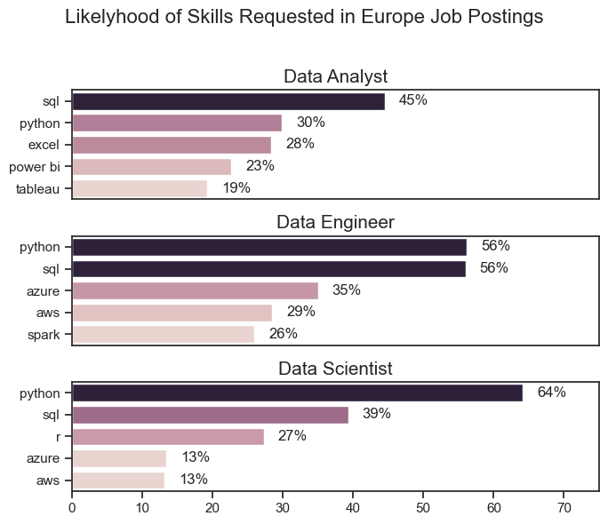
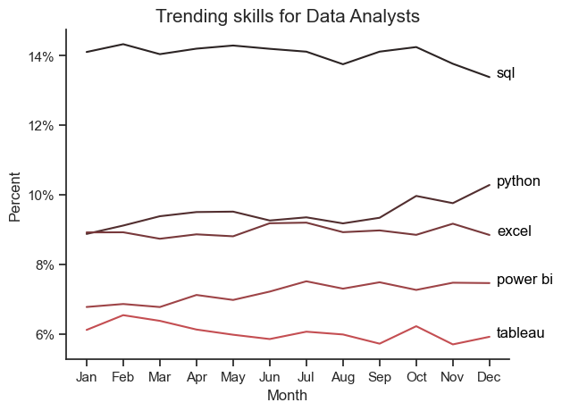
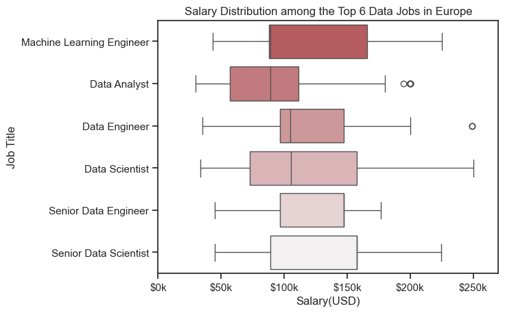
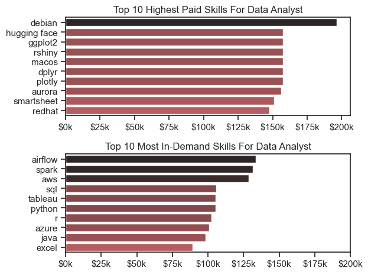
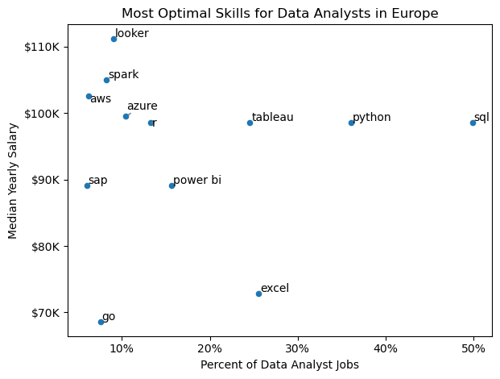
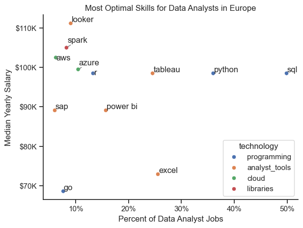

# Overview
In this project I intend to dive deep into the huge market of data jobs. The purpose of this project is to understand better what the top employers are asking for in regards to the skills for Data Analysts , Data Engineers and Data Scientist. This paper will be used as a guide to find the best fit for anyone who wishes to join this field.

The data sourced from [Luke Barousse's Python Course](https://www.youtube.com/watch?v=wUSDVGivd-8&t=36698s&ab_channel=LukeBarousse) which provides a foundation for my analysis, containing detailed information on job titles, salaries, locations, and essential skills. Through a series of Python scripts, I explore key questions such as the most demanded skills, salary trends, and the intersection of demand and salary in data analytics.


 # The Questions 

 Here are the questions I aim to answer in this project:

1. What are the skills most in demand for the top 3 most popular data roles?

2. How are in-demand skills trending for Data Analysts?

3. How well do jobs and skills pay for Data Analysts?

4. What are the optimal skills for data analysts to learn? (High Demand AND High Paying)


# Tools I Used
- **Python** : The backbone of my analysis, allowing me to analyze the data and find critical insights.I also used the following Python libraries:

  - **Pandas Library**: This was used to analyze the data.
  - **Matplotlib Library**: I visualized the data.
  - **Seaborn Library**: Helped me create more advanced visuals.
- **Jupyter Notebooks**: The tool I used to run my Python scripts which let me easily include my notes and analysis.
- **Visual Studio Code**: My go-to for executing my Python scripts.
- **Git & GitHub**: Essential for version control and sharing my Python code and analysis, ensuring collaboration and project tracking.

# Data Preparation and Cleanup
This section outlines the steps taken to prepare the data for analysis, ensuring accuracy and usability.
## Import & Clean Up Data
I start by importing necessary libraries and loading the dataset, followed by initial data cleaning tasks to ensure data quality.

```python
# Importing Libraries
import ast
import pandas as pd
import seaborn as sns
from datasets import load_dataset
import matplotlib.pyplot as plt  

# Loading Data
dataset = load_dataset('lukebarousse/data_jobs')
df = dataset['train'].to_pandas()

# Data Cleanup
df['job_posted_date'] = pd.to_datetime(df['job_posted_date'])
df['job_skills'] = df['job_skills'].apply(lambda x: ast.literal_eval(x) if pd.notna(x) else x)
```

# Filter Data jobs in Europe

``` python
european_countries = [
    "Albania", "Andorra", "Armenia", "Austria", "Azerbaijan", "Belarus", 
    "Belgium", "Bosnia and Herzegovina", "Bulgaria", "Croatia", "Cyprus", 
    "Czech Republic", "Denmark", "Estonia", "Finland", "France", "Georgia", 
    "Germany", "Greece", "Hungary", "Iceland", "Ireland", "Italy", "Kazakhstan", 
    "Kosovo", "Latvia", "Liechtenstein", "Lithuania", "Luxembourg", "Malta", 
    "Moldova", "Monaco", "Montenegro", "Netherlands", "North Macedonia", "Norway", 
    "Poland", "Portugal", "Romania", "Russia", "San Marino", "Serbia", "Slovakia", 
    "Slovenia", "Spain", "Sweden", "Switzerland", "Turkey", "Ukraine", "United Kingdom", 
    "Vatican City"
]

df_europe = df[df['job_country'].isin(european_countries)].copy()
df_skills = df_europe.explode('job_skills')
```

# The Analysis 
I have broken this presentation into 4 parts, one for each question that i want to adress. Here is how I approached each question:

# 1.What are the most demanded skills for the top 3 most popular data roles?

First I Wanted to look for the skills that appear the most among the top 3 Data Roles, and I filtered the dataset for exactly this purpose. This code presents the most popular Job Titles and their related top skills .

View my notebook with all the stepts i took here: [2_Skill_Demand.ipynb](3_Project/2_Skill_Demand.ipynb)

## Visualize Data 
```python
fig,ax = plt.subplots(len(job_titles) , 1,figsize=(7, 6 ))
sns.set_theme(style= 'ticks')
for i,job_title in enumerate(job_titles):
    df_plot = jobs_europe_perc[jobs_europe_perc['job_title_short'] == job_title].head(5)
    sns.barplot(data = df_plot , x='skills_percent',y='job_skills',ax = ax[i] , hue = 'skill_count',legend = False)
```
## Results 


# Insights
- As we can conclude from the graphs, the most versatile skill in this list is ```Python```, being present in over *60%* of the ```Data Scientist jobs```, in almost *60%* of the ```Data Enginner``` jobs, and in 1 of 3 data Analyst job
- On the second place we have sql, being equally as present as ```Python``` in the Data Engineer roles , the second most demanded skill for ```Data Scientist```(*39%*) and the most demanded skill for Data Analysts(*45%*)
- For the ```Data Analyst``` roles the visualisation tools are the ones that are next in the top of most demanded skills(*Power Bi, Tableu*), and for the ```Data Scientist``` and ```Data Enginner``` more practical skill for managing databases are important(*```Aws```, ```Azure```*)


# How are in-demand skills trending for Data Analysts?

For this question i tried to find some insights into how the demand for the top 5 skills was fluctuating during the year of 2023.

Here is the detailed notbook with my work: [3_Skill_Trend.ipynb](3_Project/3_Skill_Trend.ipynb)

# Visualise The Data
```python
from matplotlib.ticker import PercentFormatter
df_plot = DA_total_percent.iloc[:,:5]
sns.set_theme(style= 'ticks')
sns.lineplot(data=df_plot,dashes = False,legend = False , palette = 'dark:r')
sns.despine()
plt.title('Trending skills for Data Analysts',fontsize = 15)
plt.ylabel('Percent')
plt.xlabel('Month')
plt.gca().yaxis.set_major_formatter(PercentFormatter(decimals=0))
for i in range(5):
    plt.text(11.2, df_plot.iloc[-1, i], df_plot.columns[i], color='black')
```
## Results


# Insights

- We can see a slight decrease in the demand for SQL at the end of the year compared to the begining 
- From the graph we can observe a increase in the demand for Python over the year of 2023
- The other tools' demand had some fluctuation over the year but overall they remained steady
- The data on Europe Data Analyst jobs doesn't give us much information on how the demand for skills is going to change for the next year


# How much do the top 6 most popular jobs pay?

To indentify the Top 6 jobs I filtered for the jobs with the most job postings in Europe and ordered them through their median salary, and I tried to find out what is the pay gap between these jobs.

Here is the notebook with all my detailed work : [4_Salary_Analysis.ipynb](3_Project/4_Salary_Analysis.ipynb)

## Visualize the Data

```python
sns.boxplot(data = df_job_titles , x='salary_year_avg', y='job_title_short',order = df_order,palette = 'light:r')
sns.set_theme(style = 'ticks')
plt.xlim(0,270000)
plt.ylabel('Job Title')
plt.xlabel('Salary(USD)')
plt.title('Salary Distribution among the Top 6 Data Jobs in Europe')
ax.xaxis.set_major_formatter(plt.FuncFormatter(lambda y, pos: f'${int(y / 1000)}k'))
```

### Results 


### Insights

- The jobs on the bottom of the graph tend to have the highest median salary, the highest paying jobs being ```Senior Data Engineer``` and ```Senior Data Scientist``` with median salaries of around $150k
- The ```Machine Learning Engineer``` has lowest median salary , being very close to the Data Analyst jobs in Europe
- The ```Senior Data Analyst``` doesn't appear on the list, and the conclusion that we can draw from this is that after you gain experiecne as a Data Analyst, you can try to access different fields that are payed better, such as ```Data Scientist or ```Data Engineer```

# Highest Paid & Most Demanded Skills for Data Analysts

Here we have a breakdown on how The Most Demanded Skills pay vs. The Best Paying Skills.

## The code needed:
```python
fig,ax = plt.subplots(2,1)
sns.barplot(data = top_pay , x= 'median' , y = 'job_skills' ,hue = 'median',  ax = ax[0] , palette= 'dark:r_r' , legend = False)
ax[0].set_title('Top 10 Highest Paid Skills For Data Analyst')
ax[0].set_xlabel('')
ax[0].set_ylabel('')
ax[0].xaxis.set_major_formatter(plt.FuncFormatter(lambda y, pos: f'${int(y / 1000)}k'))

sns.barplot(data = top_skills , x= 'median' , y = 'job_skills' , hue = 'median', ax = ax[1] , palette = 'dark:r_r' , legend = False)
ax[1].set_title('Top 10 Most In-Demand Skills For Data Analyst')
ax[1].xaxis.set_major_formatter(plt.FuncFormatter(lambda y, pos: f'${int(y / 1000)}k'))
ax[1].set_xlabel('Median Salary(USD)')
ax[1].set_xlabel('')
ax[1].set_ylabel('')
ax[1].invert_yaxis()
ax[1].set_xlim(0,200000)
```

## Results


## Insights 

- The jobs that pay the most appear much less than the ones that are most demanded on the job postings in Europe
- The most demanded skills(*Python, SQL and Tableu*) are somewhere in the middle regarding the ammount employers are willing to pay
- Airflow, Spark and AWS are the skills that are most demanded and pay the best


# 4. What are the optimal skills a Data Analyst should know in Europe?

After all the insights that we got from the previous questions , I wanted to identify what is actually the best path a Data Analyst is supposed to take in regards to the skills he has to learn in order to achieve the highest efficiency.

So in order to find out the answer to this question i calculated the salary and the percentage of each job skills and i compared them using a scatter plot.

View my notebook here :[5_Optimal_Skills.ipynb](3_Project/5_Optimal_Skills.ipynb)

## Visualize Data 
```python
from adjustText import adjust_text
from matplotlib.ticker import PercentFormatter

df_skill_demand.plot(kind='scatter', x='skill_percentage', y='median_salary')
plt.xlabel('Percent of Data Analyst Jobs')
plt.ylabel('Median Yearly Salary')
plt.title(f'Most Optimal Skills for Data Analysts in Europe')
plt.tight_layout()
```
## Results 

Here we have the base of the visualisation that we are going to improve to get even more insights for the next part

## Insights 

- As we can see from the graph , the most optimal skills for Data Analysts,being closer to the upper right corner in Europe are ```SQL``` , ```Python``` and ```Tableau```, 
being in at least one third of job postings and havin a median salary of over $90k/year.
- The skills with the highest pay are ```Looker``` ,```Spark``` and ```AWS``` but they are not as present into the job postings for Data Analysts compared with the basic skills required, meaning that they are more oriented towards specific job postings 
- The least optimal skills (*Lower left corner*)  are the Microsoft based skills, such as ```Powerpoint``` and ```Word```

# Visualizing Different Technologies
This is the part where we can see every skill and their related techonoly. We'll add color labels based on the technology (e.g., {Programming: Python}).

## Visualize Data 
```python
from adjustText import adjust_text
from matplotlib.ticker import PercentFormatter

sns.scatterplot(
    data = df_plot , 
    x ='skill_percentage' ,
    y = 'median_salary',
    hue = 'technology' )
```

# Results 


A scatter plot visualizing the most optimal skills (high paying & high demand) for data analysts in Europe with color labels for technology. 

# Insights 

- This scatter plot presents the prevalence of ```programming``` and ```analyst tools``` skills among the top optimal Data Analytics skills , occuping 9 of the total of 14.
- The other two categories of ```cloud``` and ```libraries``` skills (AWS,Azure, and Spark) tend to have the best pay but also the smallest presence among the job postings in Europe.
- The plot shows that the ```programming``` and some of the analytical tools have the best places into this scatter plot, having a good pay and a good ammount of postings .


# What I Learned
Throughout this project, I deepened my understanding of the data analyst job market and enhanced my technical skills in Python, especially in data manipulation and visualization. Here are a few specific things I learned:
- **Advanced Python Usage**: Utilizing libraries such as Pandas for data manipulation, Seaborn and Matplotlib for data visualization, and other libraries helped me perform complex data analysis tasks more efficiently.
- **Data Cleaning Importance**: I learned that thorough data cleaning and preparation are crucial before any analysis can be conducted, ensuring the accuracy of insights derived from the data.
- **Strategic Skill Analysis**: The project emphasized the importance of aligning one's skills with market demand. Understanding the relationship between skill demand, salary, and job availability allows for more strategic career planning in the tech industry.

# Conclusion
This project helped me understand what I am supposed to look for when looking for a job in the Data field. This project can act as a guide , for me and for other persons in Europe that want to get some help into what path in this domain is the most appropriate for them. As this market continues to change , more exploration is necessary, but this study can still act as a foundation for more specific research in the future. 